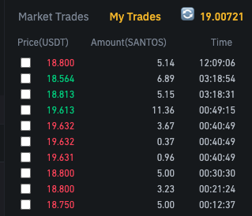
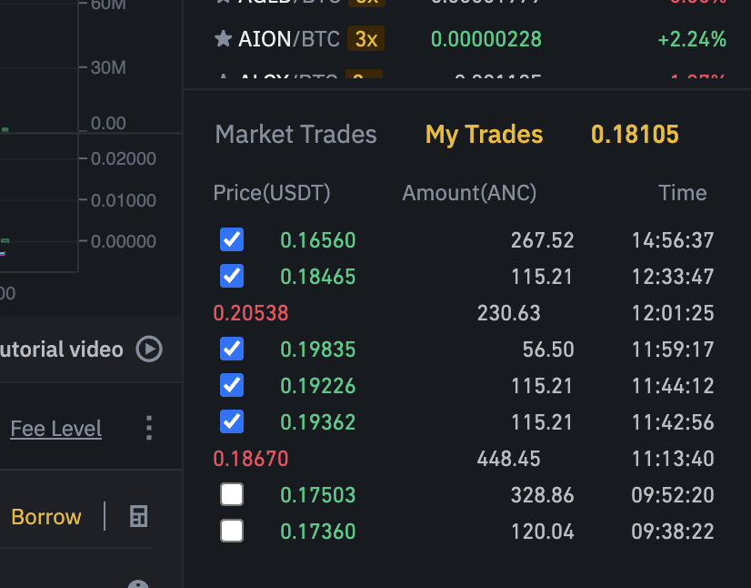

# My Binance Average Price Calculator

## Description

Chrome extension that calculates the average price of a cryptocurrency on Binance.

## TODO

- [x] allow to calculate the average price of sells (for shorts) in the My Tabs section
- [x] calculate in the Order History section
- [x] allow to calculate the average price of sells (for shorts) in the Order History section
- [ ] re-calculate when switching between coins
